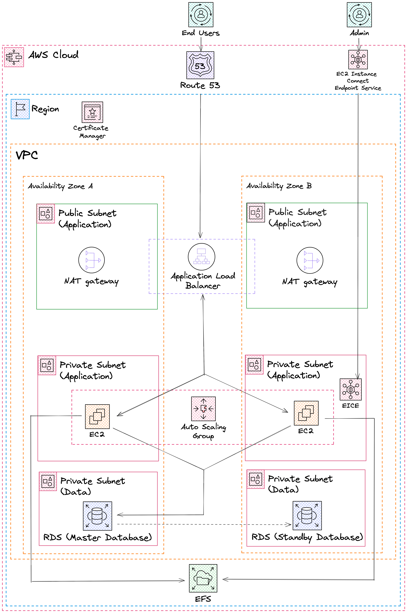

# Host a WordPress website on AWS
Instructions on how I hosted a WordPress website on AWS. After my previous AWS DevOps project where I hosted a static website, I decided to try hosting a WordPress website next. The WordPress website was deployed with security, scalability and reliability in mind and therefore the architecture and AWS services used in this project reflect this.

## Reference architecture 



## The Infrastructure Setup

**Configure VPC**
  - I configured a VPC with 2 public subnets and 4 private ones for my EC2 and database instances.

**Deployed an Internet Gateway**
  - Facilitated connectivity between VPC instances and the wider Internet.

**Created route table**
  - Created route table to make the public subnets public
  - Routes to the internet and is associated with the public subnets
  - Routes traffic through the internet gateway

**Established security groups**
  - To control inbound and outbound traffic to and from my EC2 instances and other resources

**Leveraged two availability zones**
  - Enhanced system reliability and fault tolerance by using multiple availability zones.

**Public subnets**
  - In my 2 public subnets I created the Nat gateway and Application Load Balancer.
      - I used the NAT gateway to allow resources in the private subnet to have access to the internet but not allow internet users access to my resources.
  - Application load balancer also exists in the public subnet.
      - It allows users to access the website hosted on servers in the private subnet
      - Created a target group witht the servers in it so that the ALB will route traffic to the servers in that target group.

**EC2 instance connect endpoint**
  - Enabled me to have secure connections to assets within bothe the public and private subnets. Eliminated the need for SSH connections.
      - This minimizes the risks associated with handling and managing SSH keys. Improved security!

**Auto scaling group**
  - Using the Auto scaling group with a launch template for the EC2 instances I was able to deploy the WordPress website.
  - This auto scaling group ensured website availability, scalability, fault tolerance, and elasticity.

**SNS notifications**
  - Set up SNS notifications in the auto scaling group to notify me when the auto scaling group terminates or launches EC2 instances.

**Registered Domain Name and Configured DNS Record**
  - Used Route 53 to register the domain name and set up the DNS record.
  - Ensured secure application communications by using AWS Certificate Manager.

## Bash Script
The following bash script was used to deploy the WordPress website on the EC2 instances. 

```bash
#!/bin/bash
# update the software packages on the ec2 instance 
sudo yum update -y

# install the apache web server, enable it to start on boot, and then start the server immediately
sudo yum install -y http

d
sudo systemctl enable httpd 
sudo systemctl start httpd

# install php 8 along with several necessary extensions for wordpress to run
sudo dnf install -y \
php \
php-cli \
php-cgi \
php-curl \
php-mbstring \
php-gd \
php-mysqlnd \
php-gettext \
php-json \
php-xml \
php-fpm \
php-intl \
php-zip \
php-bcmath \
php-ctype \
php-fileinfo \
php-openssl \
php-pdo \
php-tokenizer

# install the mysql version 8 community repository
sudo wget https://dev.mysql.com/get/mysql80-community-release-el9-1.noarch.rpm 
#
# install the mysql server
sudo dnf install -y mysql80-community-release-el9-1.noarch.rpm 
sudo rpm --import https://repo.mysql.com/RPM-GPG-KEY-mysql-2023
sudo dnf repolist enabled | grep "mysql.*-community.*"
sudo dnf install -y mysql-community-server 
#
# start and enable the mysql server
sudo systemctl start mysqld
sudo systemctl enable mysqld

# environment variable
EFS_DNS_NAME=fs-02d3268559aa2a318.efs.us-east-1.amazonaws.com

# mount the efs to the html directory 
echo "$EFS_DNS_NAME:/ /var/www/html nfs4 nfsvers=4.1,rsize=1048576,wsize=1048576,hard,timeo=600,retrans=2 0 0" >> /etc/fstab
mount -a

# set permissions
chown apache:apache -R /var/www/html

# restart the webserver
sudo service httpd restart
```
